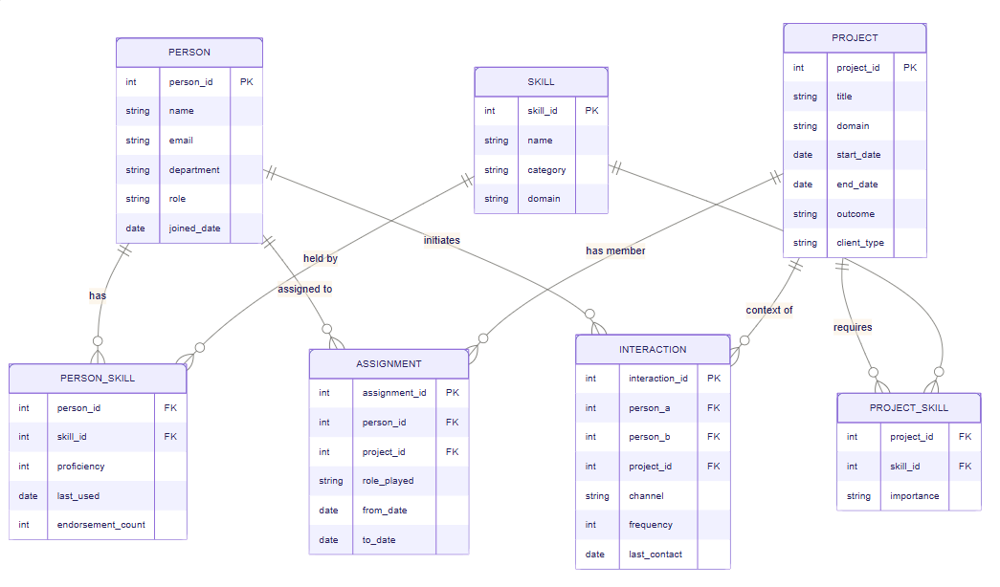

# Organizational Knowledge Management System

> **Making dark data queryable.**

An evidence-based staffing and organizational intelligence system built for a Business Data Management capstone project. It transforms derived metadata from emails, chats, and project history into a structured PostgreSQL database that managers can query.



## Why This Project Exists

Organizations produce valuable knowledge every day through conversations, collaboration, and completed projects. Much of that knowledge becomes **organizational dark data**: it exists, but it is difficult to search, compare, or reuse.

This system addresses one practical question:

> **Who is the best person to assign to this project?**

Instead of relying only on opinions or self-reported resumes, managers can use demonstrated skills, proficiency, recency, endorsements, domain experience, assignment history, and collaboration patterns.

## How The System Works

The project follows a simple data flow:

1. **Capture structured entities** such as people, skills, and projects.
2. **Connect entities** through assignments and skill junction tables.
3. **Preserve useful evidence** such as proficiency, last-used dates, project outcomes, and endorsements.
4. **Represent collaboration safely** through interaction metadata rather than private message content.
5. **Query the evidence** to rank candidates, identify skill gaps, and reveal organizational patterns.

Raw email or chat messages are intentionally not stored. The `interaction` table keeps only derived metadata: who communicated, in which project context, through which channel, how often, and when.

## Entity-Relationship Diagram

The diagram above shows the seven-table `capstone` schema. The central relationships are:

```text
PERSON 1 -----< PERSON_SKILL >----- 1 SKILL
   |                                  |
   |                                  +-----< PROJECT_SKILL >----- PROJECT
   |                                                               |
   +-----< ASSIGNMENT >-------------------------------------------+
   |
   +-----< INTERACTION >-------------------------------------------+
```

The crow's-foot side represents the many side of each relationship. Junction tables carry the relationships that need additional business information, such as proficiency, importance, role, and dates.

## Database Schema

All tables are created in the PostgreSQL schema named `capstone`.

### 1. `person`

The employee master table. Each person has a unique email address and may also have a department, role, and date of joining the organization.

| Column | Purpose |
|---|---|
| `person_id` | Auto-generated primary key. |
| `name` | Employee's display name. |
| `email` | Unique employee contact identifier. |
| `department` | Organizational group, such as Engineering or Analytics. |
| `role` | Current organizational role. |
| `joined_date` | Date the person joined the organization. |

This table is the anchor for staffing, skill ownership, and collaboration analysis.

### 2. `skill`

The canonical skill reference table. A skill is stored once so that `Machine Learning`, for example, remains the same entity when it is held by a person and required by a project.

| Column | Purpose |
|---|---|
| `skill_id` | Auto-generated primary key. |
| `name` | Unique skill name. |
| `category` | Broad classification: `Technical`, `Soft`, or `Domain`. |
| `domain` | Related area, such as Data Science, Fintech, or Healthcare. |

Keeping skills in a master table prevents inconsistent spellings and makes category-level analysis possible.

### 3. `project`

The project history table. It records completed and ongoing initiatives, including their business domain, client type, dates, and outcome.

| Column | Purpose |
|---|---|
| `project_id` | Auto-generated primary key. |
| `title` | Project name. |
| `domain` | Business or organizational domain. |
| `start_date`, `end_date` | Project period; `end_date` may be empty for ongoing work. |
| `outcome` | Result such as `Success`, `Ongoing`, or `Cancelled`. |
| `client_type` | Client context such as Fintech, Healthcare, Retail, or Internal. |

Project history is what lets the candidate finder distinguish relevant experience from skill presence alone.

### 4. `person_skill`

The person-to-skill junction table. It turns a simple skill list into useful evidence about depth and freshness.

| Column | Purpose |
|---|---|
| `person_id`, `skill_id` | Composite primary key and foreign keys to the related entities. |
| `proficiency` | Self or organization-assessed level from 1 to 5. |
| `last_used_date` | Most recent known use of the skill. |
| `endorsement_count` | Number of supporting endorsements. |

This is one of the most important analytical tables: candidates can be ranked by proficiency, recency, and endorsements instead of simply being marked as qualified or unqualified.

### 5. `assignment`

The project staffing history table. It records who worked on which project, the role they played, and the period of involvement.

| Column | Purpose |
|---|---|
| `assignment_id` | Auto-generated primary key. |
| `person_id`, `project_id` | Foreign keys connecting a person to a project. |
| `role_played` | Historical responsibility, such as Lead, Contributor, or Reviewer. |
| `from_date`, `to_date` | Assignment period. |

Assignments provide the strongest evidence of applied experience and support domain-based candidate recommendations.

### 6. `project_skill`

The project-to-skill junction table. It defines the capability profile of each project and distinguishes mandatory skills from useful extras.

| Column | Purpose |
|---|---|
| `project_id`, `skill_id` | Composite primary key and foreign keys to the related entities. |
| `importance` | Requirement weight, typically `Required` or `Preferred`. |

This table powers skill-gap detection and project coverage calculations.

### 7. `interaction`

The derived collaboration metadata table. It describes communication between two people in a project context without storing message content.

| Column | Purpose |
|---|---|
| `interaction_id` | Auto-generated primary key. |
| `person_a`, `person_b` | Foreign keys to the two people in the interaction. |
| `project_id` | Project context for the collaboration. |
| `channel` | Communication channel such as `email`, `slack`, or `meet`. |
| `frequency` | Number of derived interactions. |
| `last_contact` | Most recent contact date. |

This table enables collaboration-network and top-collaborator analysis while respecting data minimization principles.

## Key Business Questions

The main business logic is in `06_candidate_finder.py`.

### Skill Match Ranking

Given a skill name, rank everyone who has that skill by proficiency and most recent use. This is useful for quickly finding specialists when a project requirement is already known.

### Multi-Skill And Domain Match

Given a skill and a project domain, find people who have the skill and have previously worked in that domain. The number of past projects provides evidence of applied experience.

### Skill Gap Detection

Given a project title, compare required skills with the skills held by its assigned people. The result identifies required capabilities that are not currently covered.

## Setup

### Prerequisites

- Python 3.10 or newer
- A PostgreSQL database with the pgvector extension available (such as Supabase)
- A connection string with permission to create the `capstone` schema and enable the `vector` extension

### Installation

1. Clone the repository and open the project directory.
2. Activate the virtual environment:

   ```powershell
   .\bdmvenv\Scripts\Activate.ps1
   ```

3. Install the required packages:

   ```bash
   pip install -r requirements.txt
   ```

4. Create a local `.env` file in the repository root (the app loads it automatically):

   ```text
   DATABASE_URL=your_supabase_connection_string
   GROQ_API_KEY=your_groq_api_key
   GROQ_MODEL=openai/gpt-oss-20b
   ```

   Replace the placeholders with your own credentials on your machine. `GROQ_API_KEY` is optional; without it, retrieval
   still works and the app skips LLM answer generation. You can also enter the key in the app for the current session.
   Never commit or upload `.env`, paste API keys into this README, or share them in source control. `.env` is ignored by Git.
   The app defaults to the `openai/gpt-oss-20b` model; set `GROQ_MODEL` to override it.

5. Create the relational schema and sample data:

   ```bash
   python 00_create_schema.py
   python 01_seed_data.py
   ```

6. Start the teaching app:

   ```bash
   streamlit run app.py
   ```

   In **Build embeddings**, create the pgvector index from the seeded people and projects. The app downloads and runs the
   lightweight `sentence-transformers/all-MiniLM-L6-v2` embedding model locally on first use. In **Ask the knowledge graph**,
   ask a business question to see vector matches and the connected relational evidence. Without a Groq key, retrieval still
   works and the app clearly indicates that LLM answer generation is not enabled.

7. Start the database dashboard to browse and manage normalized KMS records:

   ```bash
   streamlit run dashboard_kms.py
   ```

   The dashboard is organized around an employee directory and individual profiles (service period, proficiency-rated skills,
   endorsements, project history, and collaborators), plus readable project profiles with team and required-skill coverage.
   Its **Insights** page explains the CTEs and assumptions behind candidate, collaborator, and skill-coverage measures; the
   application queries the normalized tables directly and does not create a star schema or persisted reporting tables.
   **Data management** keeps direct create/edit/delete access to all seven normalized tables in one advanced page, displaying
   names instead of foreign-key IDs. Deletes are permanent and PostgreSQL blocks deletion of referenced records.

### KMS Dashboard Guide

The dashboard connects directly to the same `DATABASE_URL` as the SQL scripts and reads the existing `capstone` schema.
It does not require embeddings or Groq. Run the schema and seed scripts first if the database is empty.

- **Overview** summarizes people, projects, skills, assignments, department headcount, project outcomes, and widely held skills.
- **People** provides a searchable directory with department and join-date filters. Open a profile to see service duration,
  recorded skills and 1–5 proficiency ratings, endorsement counts, last-used dates, project assignments, and collaborators.
  Average proficiency is the arithmetic mean of the employee's recorded skill ratings; it is not weighted by endorsements.
- **Projects** supports search across project text, team members, and required skills, with an optional project-start-date range.
  Project profiles show named team members and project-by-project required-skill coverage.
- **Insights** includes potential underutilization signals, top collaborators, and required-skill coverage. Expand the
  calculation details to review the CTE approach, formulas, and caveats before interpreting the results.
- **Data management** is the advanced maintenance area for all seven normalized tables. Browse views show names and joined
  labels rather than foreign-key IDs. Create, edit, and delete forms use database constraints; deletes are permanent and can
  be blocked when another row references the record.

#### How to Interpret the Insights

The dashboard queries the normalized tables directly. CTEs (`WITH` clauses) create temporary intermediate results for each
query; they are not persisted reporting tables. The current implementation does not create a star schema or data warehouse.

- **Potentially underutilized candidates** is a review heuristic: a person has a proficiency rating of at least 4/5 for a skill
  not used within the selected window (or without a last-used date), and has no assignment considered active/recent in that
  window. It does not measure workload, availability, or actual utilization.
- **Top collaborators** sums interaction frequency for both participants on interaction records with recent `last_contact`
  dates. It ranks recorded database metadata, not independently verified meetings or messages.
- **Project skill coverage** counts a required skill as covered if at least one assigned person has that skill in
  `person_skill`. Coverage is covered requirements divided by all required skills. It does not apply a proficiency threshold
  or check recency; projects without required skills are marked not applicable.

8. The original SQL teaching scripts can be run after seeding:

   ```bash
   python 02_explore_tables.py
   python 03_aggregates.py
   python 04_where_filters.py
   python 05_joins.py
   python 06_candidate_finder.py
   python 07_analytics.py
   ```

`00_create_schema.py` drops and recreates the `capstone` schema, so use it only when a clean reset is intended. Run the seed script again only after the schema has been recreated.

The Streamlit app creates `capstone.knowledge_embedding` and its cosine-search index when embeddings are built. The table stores
derived person/project text, model name, and 384-dimensional vectors; it does not modify the original seven business tables.
The app's graph expansion uses SQL joins over those existing tables, so no separate graph database is required. The walkthrough
compares standard RAG with this relational Graph RAG, and displays a live retrieval graph for each question showing vector matches
and the records reached through relational expansion. Its embedding-space view uses PCA to project the indexed person/project
vectors into two dimensions, highlights the latest retrieved records, and overlays assignment and collaboration edges from
PostgreSQL; the plotted distances are a visualization, not a replacement for those real relationships.

## Script Reference

| Script | Purpose | Concepts demonstrated |
|---|---|---|
| `00_create_schema.py` | Create the schema and seven tables. | DDL, primary keys, foreign keys, constraints |
| `01_seed_data.py` | Insert realistic sample data. | Parameterized inserts, transaction commit, junction tables |
| `02_explore_tables.py` | Inspect counts, samples, and distinct values. | SELECT, cursor metadata, pandas DataFrames |
| `03_aggregates.py` | Summarize departments, skills, interactions, and outcomes. | COUNT, AVG, SUM, GROUP BY, `idxmax()` |
| `04_where_filters.py` | Filter data using business parameters. | WHERE, parameterized queries, date intervals |
| `05_joins.py` | Connect the system's core entities. | INNER JOIN, table aliases, DataFrames |
| `06_candidate_finder.py` | Rank candidates and identify skill gaps. | Ordering, multi-table joins, subqueries |
| `07_analytics.py` | Produce deeper organizational insights. | HAVING, UNION ALL, subqueries, coverage ratios |
| `app.py` | Visualize the ERD, compare standard RAG with Graph RAG, and explore PCA/relational retrieval graphs. | Streamlit, Altair, NumPy PCA, RAG, pgvector, optional Groq |
| `dashboard_kms.py` | Explore person and project profiles, explain insight calculations, and maintain source records. | Streamlit, joined SQL/CTEs, CRUD, pandas, charts |
| `rag_backend.py` | Build embeddings, search vectors, and expand relational relationships. | MiniLM, pgvector cosine search, relational graph traversal |

## Data And Security Notes

- Do not commit `.env`; it contains database credentials and is listed in `.gitignore`.
- Do not place passwords, API keys, or raw message content in the seed scripts.
- The interaction model stores derived metadata rather than private communication content.
- Rotate database credentials immediately if they are exposed in a commit, screenshot, issue, or chat.
- The schema reset script is intended for a development or classroom database, not an unreviewed production environment.

## Project Structure

```text
.
|-- .env                  # Local secrets; ignored by Git
|-- ER_Diagram.PNG        # Entity-relationship diagram
|-- 00_create_schema.py
|-- 01_seed_data.py
|-- 02_explore_tables.py
|-- 03_aggregates.py
|-- 04_where_filters.py
|-- 05_joins.py
|-- 06_candidate_finder.py
|-- 07_analytics.py
|-- app.py
|-- dashboard_kms.py
|-- rag_backend.py
|-- requirements.txt
|-- CODE_OF_CONDUCT.md
|-- LICENSE
`-- README.md
```

## Tech Stack

- **Python** for the database scripts and analytical workflow
- **PostgreSQL** for relational storage and SQL analysis
- **Supabase** for hosted PostgreSQL infrastructure
- **psycopg2** for database connectivity
- **pandas** for readable multi-row result sets and descriptive statistics
- **Streamlit** for the interactive ERD, Graph RAG walkthrough, and KMS dashboard
- **FastEmbed / all-MiniLM-L6-v2** for local, lightweight sentence embeddings
- **pgvector** for storing and searching embeddings in PostgreSQL
- **Groq** for optional LLM answer generation

## License

This project is distributed under the MIT License. See [LICENSE](LICENSE).

## Contributing

Please read [CODE_OF_CONDUCT.md](CODE_OF_CONDUCT.md) before contributing.
